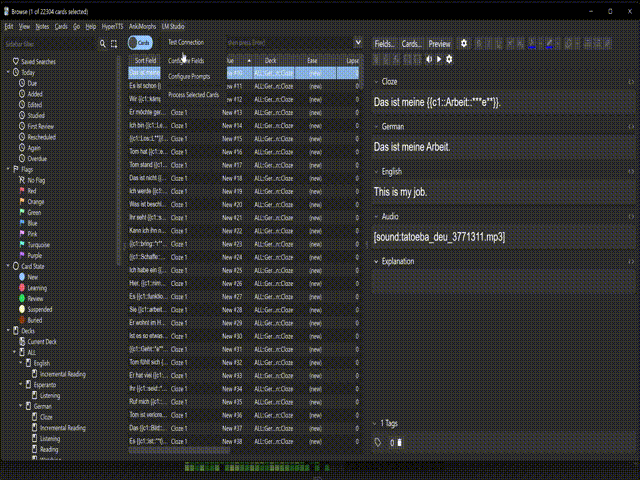

# Anki LM Studio Integration

Connect Anki to LM Studio for seamless AI-powered card generation and processing.

## Features
- Integrates two open-source tools: Anki + LM Studio
- Customizable system and user prompts
- Field-based templating with `{{field_name}}` syntax
- Batch processing of selected cards

## Prerequisites
- Anki installed
- Command line access (required for server startup)

**Note**: Results depend on model quality and prompt engineering. Larger models typically produce better outputs.

---

## Quick Setup

### Step 1: Install & Configure LM Studio

1. **Download LM Studio**
   - Get it from: https://lmstudio.ai/

2. **Download a Model**
   - Go to **Discovery** → **Model Search**
   - Download any chat model (recommended: llama-3.2 or similar)
   - (I did not have great success with DeepSeek but you can try, I usually use the gemma-3, it also seems that less than 4B gives horrible results)

3. **Load the Model**
   - Navigate to **Chat** tab
   - Click **"Select a model to load"**
   - Choose your downloaded model
   - Wait for "Model loaded" confirmation

### Step 2: Start Local Server

1. **Enable LLM Service**
   - Go to **Discovery** → **App Settings** → **Developer**
   - Check **"Enable Local LLM Service"**

2. **Start Server via Command Line**

   **Linux/Mac:**
   ```bash
   # First time only (bootstrap)
   ~/.lmstudio/bin/lms bootstrap
   
   # Start server
   lms server start
   ```

   **Windows:**
   ```cmd
   lms server start
   ```

### Step 3: Install Anki Addon

1. Open Anki
2. Go to **Tools** → **Add-ons** → **Get Add-ons**
3. Enter addon code: 777816304
4. Restart Anki

### Step 4: Test Connection

1. Open Anki **Browser**
2. Click **LM Studio** dropdown → **Test Connection**
3. Troubleshoot if errors occur (retry previous steps or contact developer)

### Step 5: Configure Output Field

1. **LM Studio** dropdown → **Configure Fields**
2. Set **Target Field** to the note field that will receive AI output
3. Click **Save Configuration**
4. Optional: Test **Preferred Model** and **Load Model** functions

### Step 6: Setup Prompts

1. **LM Studio** dropdown → **Prompt Configuration**

2. **System Prompt**: Define AI behavior, constraints, and response style

3. **User Prompt**: Your actual request/question
   - Use `{{field_name}}` to reference Anki fields
   - Example: `{{Front}}`, `{{English}}`, `{{Definition}}`
   - Works with text fields only (no image/audio support)

4. **Temperature**: Set randomness level (lower = more deterministic)

5. Click **Save Configuration**

### Step 7: Process Cards

1. **Select cards** in Anki Browser
2. **LM Studio** dropdown → **Process Selected Notes**
3. Wait for completion

---

## Field Templating

Reference any text field in your prompts using double braces:
- `{{Front}}` - Front field content
- `{{Back}}` - Back field content  
- `{{Custom_Field}}` - Any custom field name

**Limitations**: Image and audio fields not supported.


### Example Prompts
See included files for reference:
- `SystemPromptExample.txt` - Sample system prompt configurations
- `UserPromptExample.txt` - Sample user prompt templates

Use these as starting points for your own prompt engineering.


## Troubleshooting

- **Connection Issues**: Verify LM Studio server is running
- **Poor Results**: Try larger models or improve prompt engineering
- **Field Errors**: Check field names match exactly (case-sensitive)

## Demo
- 
